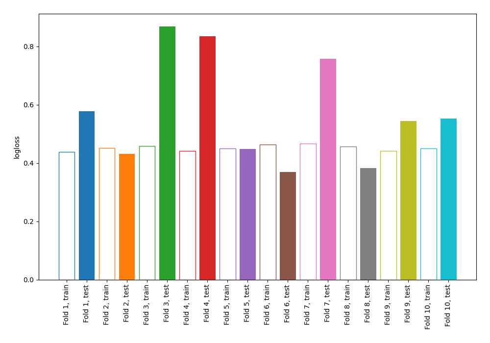

# Summary of 3_DecisionTree

## Decision Tree
- **criterion**: entropy
- **max_depth**: 3
- **explain_level**: 0

## Validation
 - **validation_type**: kfold
 - **k_folds**: 10
 - **shuffle**: False

## Optimized metric
logloss

## Training time

2.4 seconds

## Metric details
|           |    score |   threshold |
|:----------|---------:|------------:|
| logloss   | 0.576603 |  nan        |
| auc       | 0.801821 |  nan        |
| f1        | 0.663594 |    0.380894 |
| accuracy  | 0.753906 |    0.578947 |
| precision | 0.816092 |    0.743137 |
| recall    | 0.992537 |    0        |
| mcc       | 0.449922 |    0.380894 |

## Confusion matrix (at threshold=0.380894)
|                     |   Predicted as negative |   Predicted as positive |
|:--------------------|------------------------:|------------------------:|
| Labeled as negative |                     333 |                     167 |
| Labeled as positive |                      52 |                     216 |

## Learning curves
