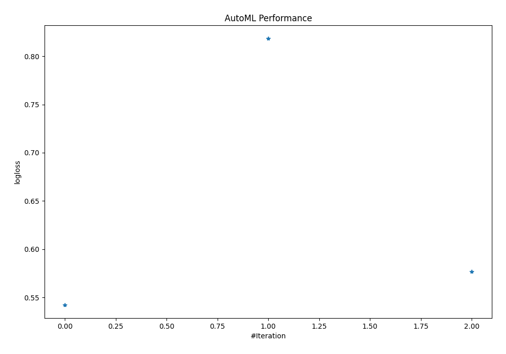
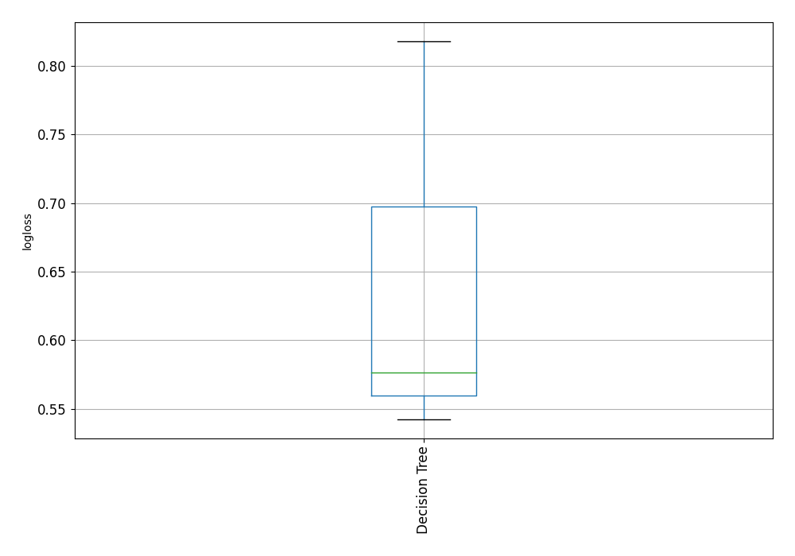

# AutoML Leaderboard

| Best model   | name           | model_type    | metric_type   |   metric_value |   train_time | Link                                     |
|:-------------|:---------------|:--------------|:--------------|---------------:|-------------:|:-----------------------------------------|
| **the best** | 1_DecisionTree | Decision Tree | logloss       |       0.542369 |         2.29 | [Results link](1_DecisionTree/README.md) |
|              | 2_DecisionTree | Decision Tree | logloss       |       0.818229 |         2.32 | [Results link](2_DecisionTree/README.md) |
|              | 3_DecisionTree | Decision Tree | logloss       |       0.576603 |         3.14 | [Results link](3_DecisionTree/README.md) |

### AutoML Performance

### AutoML Performance Boxplot
