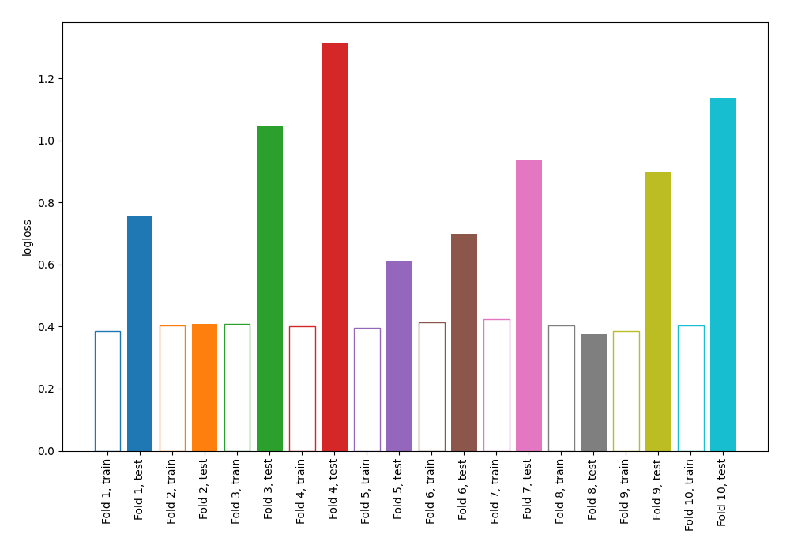

# Summary of 2_DecisionTree

## Decision Tree
- **criterion**: entropy
- **max_depth**: 4
- **explain_level**: 0

## Validation
 - **validation_type**: kfold
 - **k_folds**: 10
 - **shuffle**: False

## Optimized metric
logloss

## Training time

1.7 seconds

## Metric details
|           |    score |   threshold |
|:----------|---------:|------------:|
| logloss   | 0.818229 |  nan        |
| auc       | 0.785119 |  nan        |
| f1        | 0.657627 |    0.401717 |
| accuracy  | 0.74349  |    0.515847 |
| precision | 0.744444 |    0.764263 |
| recall    | 0.958955 |    0        |
| mcc       | 0.451952 |    0.401717 |

## Confusion matrix (at threshold=0.401717)
|                     |   Predicted as negative |   Predicted as positive |
|:--------------------|------------------------:|------------------------:|
| Labeled as negative |                     372 |                     128 |
| Labeled as positive |                      74 |                     194 |

## Learning curves
