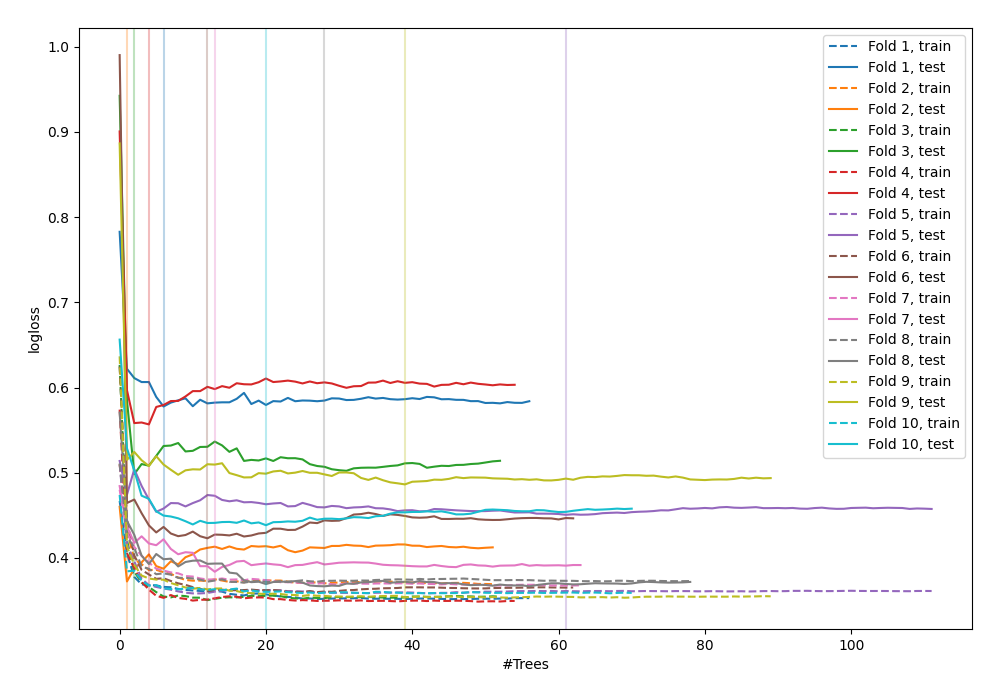

# Summary of 5_Default_RandomForest

## Random Forest
- **criterion**: gini
- **max_features**: 0.6
- **min_samples_split**: 30
- **max_depth**: 6
- **explain_level**: 0

## Validation
 - **validation_type**: kfold
 - **k_folds**: 10
 - **shuffle**: False

## Optimized metric
logloss

## Training time

18.6 seconds

## Metric details
|           |    score |   threshold |
|:----------|---------:|------------:|
| logloss   | 0.455452 |  nan        |
| auc       | 0.84959  |  nan        |
| f1        | 0.702265 |    0.338674 |
| accuracy  | 0.783854 |    0.428992 |
| precision | 0.857143 |    0.827596 |
| recall    | 1        |    0        |
| mcc       | 0.528983 |    0.418226 |

## Confusion matrix (at threshold=0.338674)
|                     |   Predicted as negative |   Predicted as positive |
|:--------------------|------------------------:|------------------------:|
| Labeled as negative |                     367 |                     133 |
| Labeled as positive |                      51 |                     217 |

## Learning curves
