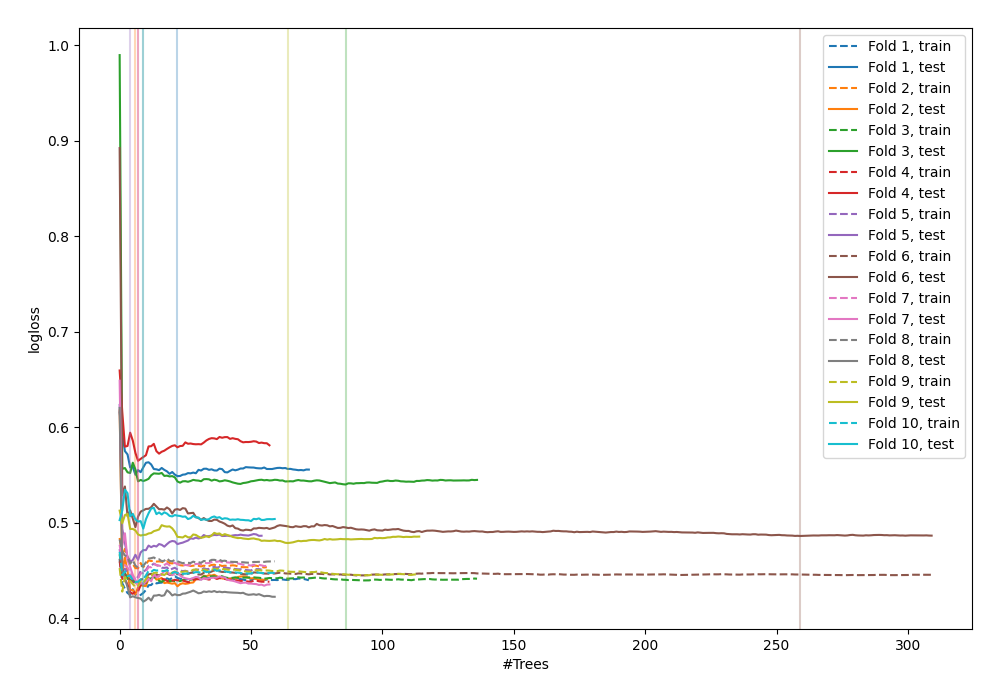

# Summary of 6_Default_ExtraTrees

## Extra Trees Classifier (Extra Trees)
- **criterion**: gini
- **max_features**: 0.6
- **min_samples_split**: 30
- **max_depth**: 6
- **explain_level**: 0

## Validation
 - **validation_type**: kfold
 - **k_folds**: 10
 - **shuffle**: False

## Optimized metric
logloss

## Training time

27.3 seconds

## Metric details
|           |    score |   threshold |
|:----------|---------:|------------:|
| logloss   | 0.484952 | nan         |
| auc       | 0.841802 | nan         |
| f1        | 0.693291 |   0.343187  |
| accuracy  | 0.779948 |   0.447959  |
| precision | 0.831776 |   0.609972  |
| recall    | 1        |   0.0109092 |
| mcc       | 0.504205 |   0.343187  |

## Confusion matrix (at threshold=0.343187)
|                     |   Predicted as negative |   Predicted as positive |
|:--------------------|------------------------:|------------------------:|
| Labeled as negative |                     359 |                     141 |
| Labeled as positive |                      51 |                     217 |

## Learning curves
