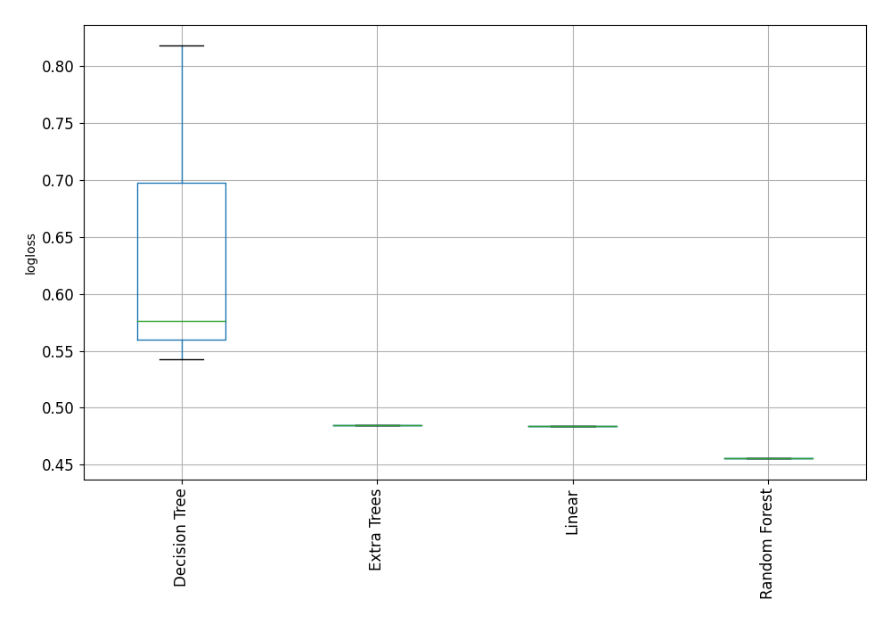

# AutoML Leaderboard

| Best model   | name                   | model_type    | metric_type   |   metric_value |   train_time | Link                                             |
|:-------------|:-----------------------|:--------------|:--------------|---------------:|-------------:|:-------------------------------------------------|
|              | 1_DecisionTree         | Decision Tree | logloss       |       0.542369 |         2.51 | [Results link](1_DecisionTree/README.md)         |
|              | 2_DecisionTree         | Decision Tree | logloss       |       0.818229 |         2.34 | [Results link](2_DecisionTree/README.md)         |
|              | 3_DecisionTree         | Decision Tree | logloss       |       0.576603 |         2.09 | [Results link](3_DecisionTree/README.md)         |
|              | 4_Linear               | Linear        | logloss       |       0.484221 |        16.76 | [Results link](4_Linear/README.md)               |
| **the best** | 5_Default_RandomForest | Random Forest | logloss       |       0.455452 |        19.39 | [Results link](5_Default_RandomForest/README.md) |
|              | 6_Default_ExtraTrees   | Extra Trees   | logloss       |       0.484952 |        28.24 | [Results link](6_Default_ExtraTrees/README.md)   |

### AutoML Performance

### AutoML Performance Boxplot
