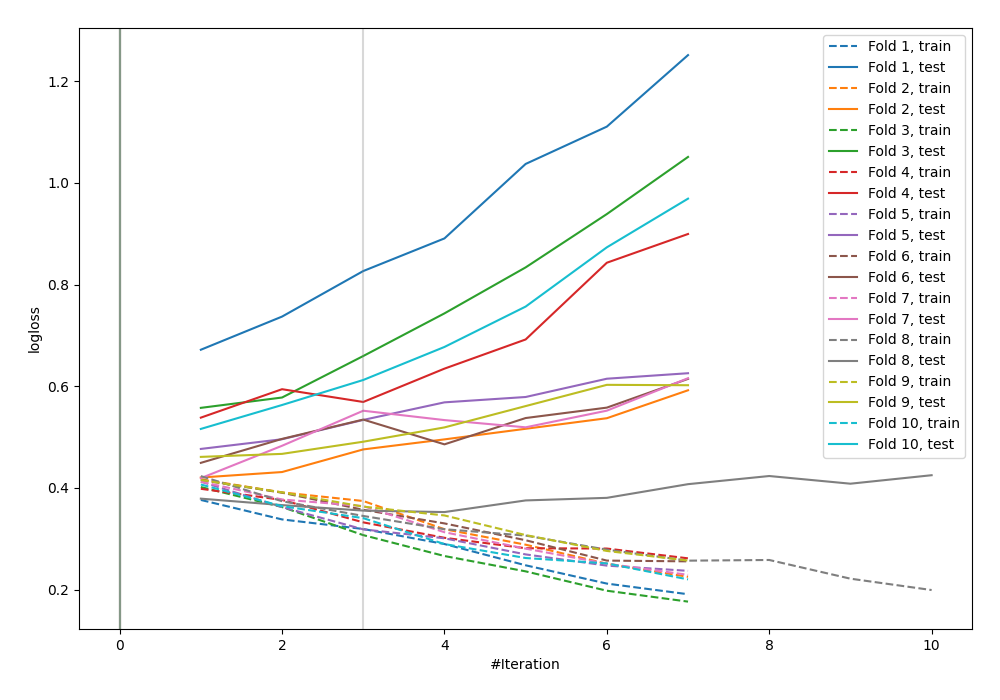

# Summary of 10_Default_NeuralNetwork

## Neural Network
- **dense_layers**: 2
- **dense_1_size**: 32
- **dense_2_size**: 16
- **dropout**: 0
- **learning_rate**: 0.05
- **momentum**: 0.9
- **decay**: 0.001
- **explain_level**: 0

## Validation
 - **validation_type**: kfold
 - **k_folds**: 10
 - **shuffle**: False

## Optimized metric
logloss

## Training time

29.3 seconds

## Metric details
|           |    score |     threshold |
|:----------|---------:|--------------:|
| logloss   | 0.486332 | nan           |
| auc       | 0.832403 | nan           |
| f1        | 0.682099 |   0.29065     |
| accuracy  | 0.777344 |   0.461987    |
| precision | 0.84058  |   0.854558    |
| recall    | 1        |   0.000178248 |
| mcc       | 0.510396 |   0.461987    |

## Confusion matrix (at threshold=0.29065)
|                     |   Predicted as negative |   Predicted as positive |
|:--------------------|------------------------:|------------------------:|
| Labeled as negative |                     341 |                     159 |
| Labeled as positive |                      47 |                     221 |

## Learning curves
