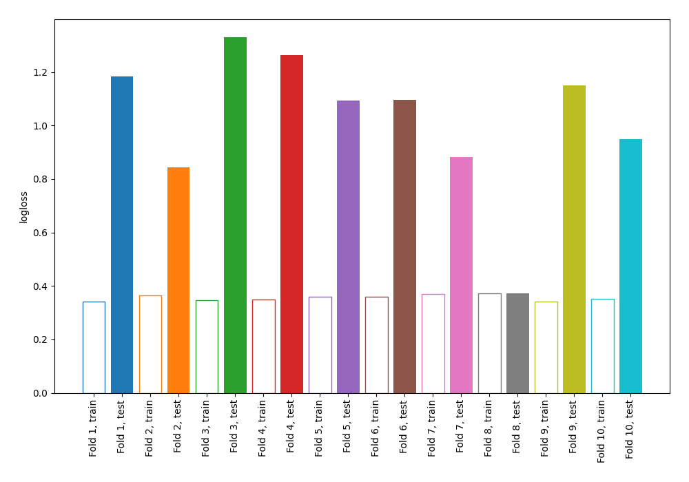

# Summary of 11_Default_NearestNeighbors

## k-Nearest Neighbors (Nearest Neighbors)
- **n_neighbors**: 5
- **weights**: uniform
- **explain_level**: 0

## Validation
 - **validation_type**: kfold
 - **k_folds**: 10
 - **shuffle**: False

## Optimized metric
logloss

## Training time

3.0 seconds

## Metric details
|           |    score |   threshold |
|:----------|---------:|------------:|
| logloss   | 1.016    |       nan   |
| auc       | 0.784836 |       nan   |
| f1        | 0.658228 |         0.3 |
| accuracy  | 0.75     |         0.5 |
| precision | 0.769231 |         0.9 |
| recall    | 0.902985 |         0   |
| mcc       | 0.443038 |         0.3 |

## Confusion matrix (at threshold=0.3)
|                     |   Predicted as negative |   Predicted as positive |
|:--------------------|------------------------:|------------------------:|
| Labeled as negative |                     344 |                     156 |
| Labeled as positive |                      60 |                     208 |

## Learning curves
