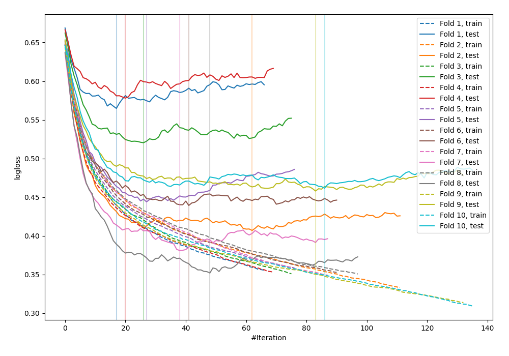

# Summary of 12_Xgboost

## Extreme Gradient Boosting (Xgboost)
- **objective**: binary:logistic
- **eval_metric**: logloss
- **eta**: 0.15
- **max_depth**: 2
- **min_child_weight**: 1
- **subsample**: 0.6
- **colsample_bytree**: 0.8
- **explain_level**: 0

## Validation
 - **validation_type**: kfold
 - **k_folds**: 10
 - **shuffle**: False

## Optimized metric
logloss

## Training time

1.6 seconds

## Metric details
|           |    score |    threshold |
|:----------|---------:|-------------:|
| logloss   | 0.46063  | nan          |
| auc       | 0.843216 | nan          |
| f1        | 0.692185 |   0.305775   |
| accuracy  | 0.776042 |   0.448342   |
| precision | 0.897959 |   0.828653   |
| recall    | 1        |   0.00526951 |
| mcc       | 0.503117 |   0.319047   |

## Confusion matrix (at threshold=0.305775)
|                     |   Predicted as negative |   Predicted as positive |
|:--------------------|------------------------:|------------------------:|
| Labeled as negative |                     358 |                     142 |
| Labeled as positive |                      51 |                     217 |

## Learning curves
