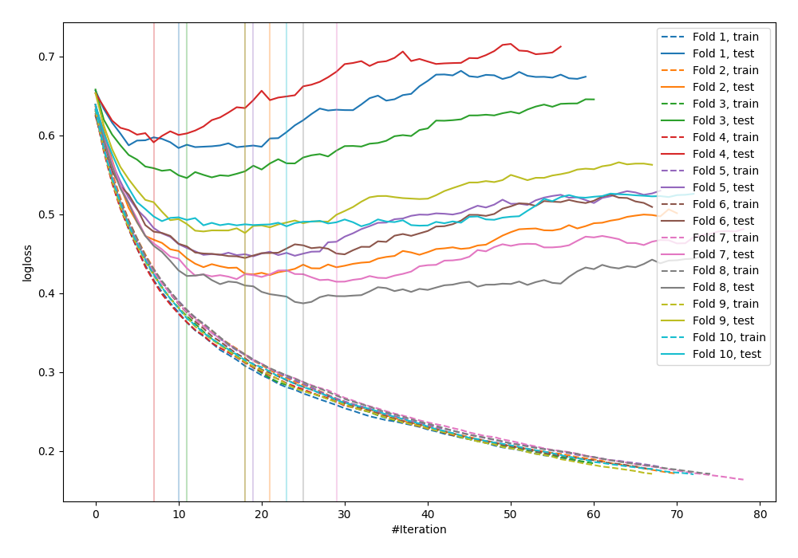

# Summary of 13_Xgboost

## Extreme Gradient Boosting (Xgboost)
- **objective**: binary:logistic
- **eval_metric**: logloss
- **eta**: 0.15
- **max_depth**: 9
- **min_child_weight**: 3
- **subsample**: 0.7
- **colsample_bytree**: 1.0
- **explain_level**: 0

## Validation
 - **validation_type**: kfold
 - **k_folds**: 10
 - **shuffle**: False

## Optimized metric
logloss

## Training time

1.7 seconds

## Metric details
|           |    score |   threshold |
|:----------|---------:|------------:|
| logloss   | 0.479894 | nan         |
| auc       | 0.83131  | nan         |
| f1        | 0.682616 |   0.331994  |
| accuracy  | 0.770833 |   0.570379  |
| precision | 0.79798  |   0.73002   |
| recall    | 1        |   0.0134291 |
| mcc       | 0.490741 |   0.437557  |

## Confusion matrix (at threshold=0.331994)
|                     |   Predicted as negative |   Predicted as positive |
|:--------------------|------------------------:|------------------------:|
| Labeled as negative |                     355 |                     145 |
| Labeled as positive |                      54 |                     214 |

## Learning curves
