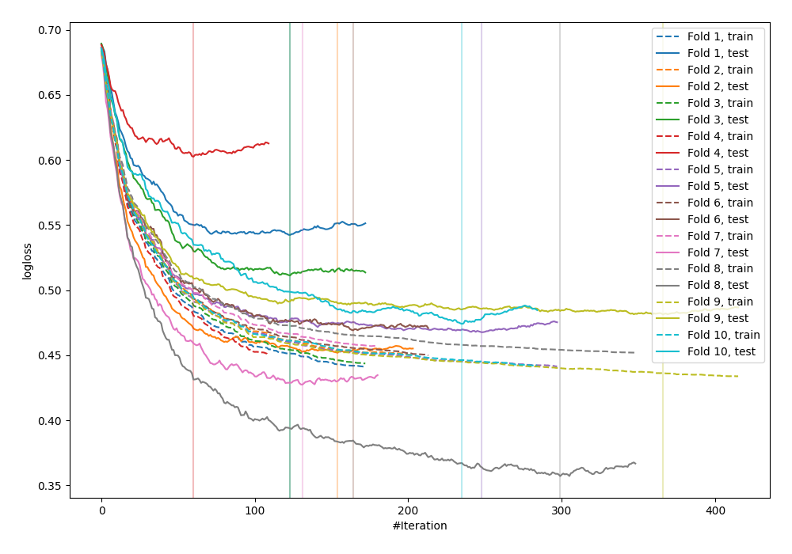

# Summary of 14_Xgboost

## Extreme Gradient Boosting (Xgboost)
- **objective**: binary:logistic
- **eval_metric**: logloss
- **eta**: 0.05
- **max_depth**: 2
- **min_child_weight**: 10
- **subsample**: 0.3
- **colsample_bytree**: 0.3
- **explain_level**: 0

## Validation
 - **validation_type**: kfold
 - **k_folds**: 10
 - **shuffle**: False

## Optimized metric
logloss

## Training time

2.1 seconds

## Metric details
|           |    score |   threshold |
|:----------|---------:|------------:|
| logloss   | 0.478465 | nan         |
| auc       | 0.83341  | nan         |
| f1        | 0.69191  |   0.387876  |
| accuracy  | 0.770833 |   0.424088  |
| precision | 0.835821 |   0.730097  |
| recall    | 1        |   0.0176978 |
| mcc       | 0.510223 |   0.387876  |

## Confusion matrix (at threshold=0.387876)
|                     |   Predicted as negative |   Predicted as positive |
|:--------------------|------------------------:|------------------------:|
| Labeled as negative |                     388 |                     112 |
| Labeled as positive |                      67 |                     201 |

## Learning curves
