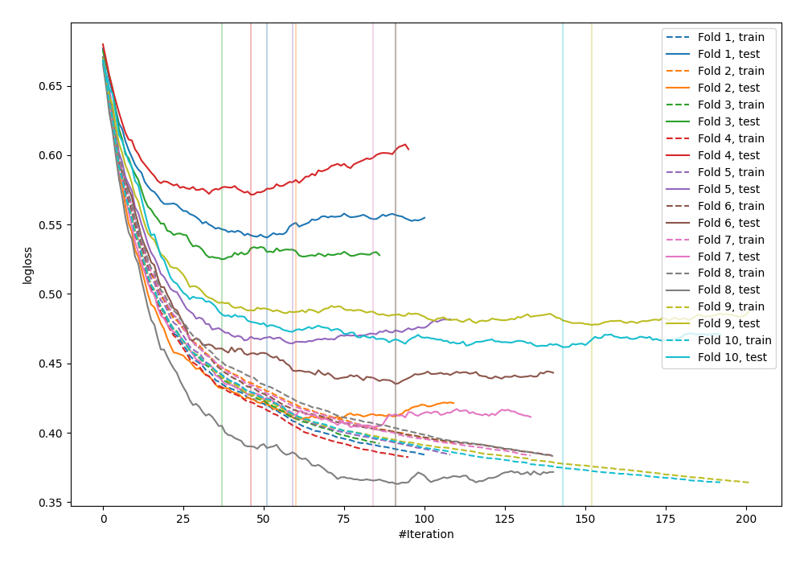

# Summary of 15_Xgboost

## Extreme Gradient Boosting (Xgboost)
- **objective**: binary:logistic
- **eval_metric**: logloss
- **eta**: 0.075
- **max_depth**: 6
- **min_child_weight**: 10
- **subsample**: 0.6
- **colsample_bytree**: 0.4
- **explain_level**: 0

## Validation
 - **validation_type**: kfold
 - **k_folds**: 10
 - **shuffle**: False

## Optimized metric
logloss

## Training time

1.8 seconds

## Metric details
|           |    score |   threshold |
|:----------|---------:|------------:|
| logloss   | 0.465318 | nan         |
| auc       | 0.842104 | nan         |
| f1        | 0.684588 |   0.408261  |
| accuracy  | 0.776042 |   0.449346  |
| precision | 0.897059 |   0.768089  |
| recall    | 1        |   0.0120667 |
| mcc       | 0.506037 |   0.408261  |

## Confusion matrix (at threshold=0.408261)
|                     |   Predicted as negative |   Predicted as positive |
|:--------------------|------------------------:|------------------------:|
| Labeled as negative |                     401 |                      99 |
| Labeled as positive |                      77 |                     191 |

## Learning curves
