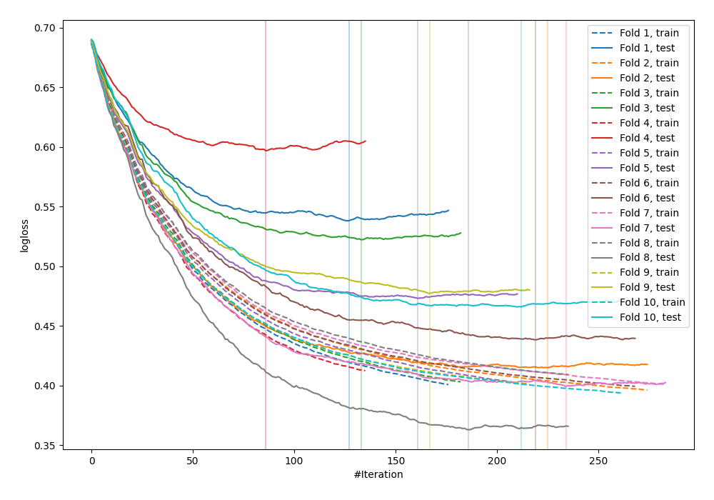

# Summary of 16_Xgboost

## Extreme Gradient Boosting (Xgboost)
- **objective**: binary:logistic
- **eval_metric**: logloss
- **eta**: 0.025
- **max_depth**: 8
- **min_child_weight**: 9
- **subsample**: 0.5
- **colsample_bytree**: 0.7
- **explain_level**: 0

## Validation
 - **validation_type**: kfold
 - **k_folds**: 10
 - **shuffle**: False

## Optimized metric
logloss

## Training time

2.3 seconds

## Metric details
|           |    score |   threshold |
|:----------|---------:|------------:|
| logloss   | 0.468918 | nan         |
| auc       | 0.839022 | nan         |
| f1        | 0.688696 |   0.396287  |
| accuracy  | 0.772135 |   0.430751  |
| precision | 0.886364 |   0.723817  |
| recall    | 1        |   0.0148748 |
| mcc       | 0.506767 |   0.396287  |

## Confusion matrix (at threshold=0.396287)
|                     |   Predicted as negative |   Predicted as positive |
|:--------------------|------------------------:|------------------------:|
| Labeled as negative |                     391 |                     109 |
| Labeled as positive |                      70 |                     198 |

## Learning curves
