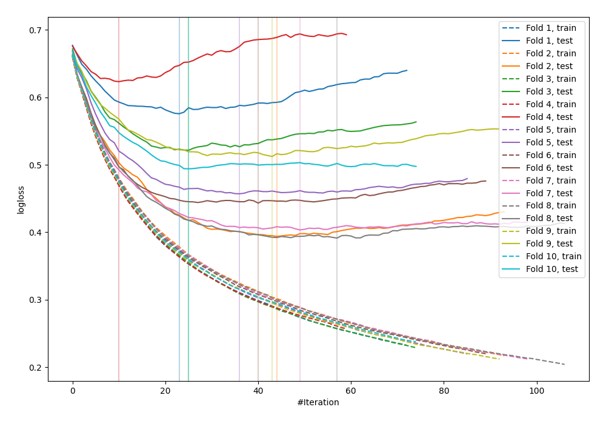

# Summary of 18_Xgboost

## Extreme Gradient Boosting (Xgboost)
- **objective**: binary:logistic
- **eval_metric**: logloss
- **eta**: 0.075
- **max_depth**: 8
- **min_child_weight**: 4
- **subsample**: 1.0
- **colsample_bytree**: 0.8
- **explain_level**: 0

## Validation
 - **validation_type**: kfold
 - **k_folds**: 10
 - **shuffle**: False

## Optimized metric
logloss

## Training time

1.7 seconds

## Metric details
|           |    score |   threshold |
|:----------|---------:|------------:|
| logloss   | 0.481519 | nan         |
| auc       | 0.82931  | nan         |
| f1        | 0.677686 |   0.358066  |
| accuracy  | 0.770833 |   0.470969  |
| precision | 0.81746  |   0.681396  |
| recall    | 1        |   0.0150884 |
| mcc       | 0.489858 |   0.469535  |

## Confusion matrix (at threshold=0.358066)
|                     |   Predicted as negative |   Predicted as positive |
|:--------------------|------------------------:|------------------------:|
| Labeled as negative |                     368 |                     132 |
| Labeled as positive |                      63 |                     205 |

## Learning curves
