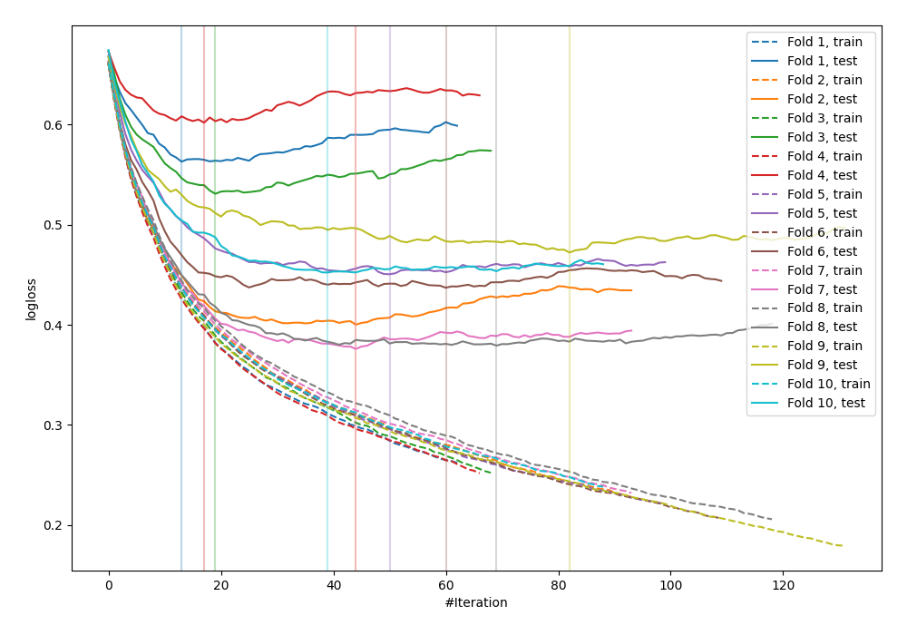

# Summary of 19_Xgboost

## Extreme Gradient Boosting (Xgboost)
- **objective**: binary:logistic
- **eval_metric**: logloss
- **eta**: 0.1
- **max_depth**: 4
- **min_child_weight**: 1
- **subsample**: 0.9
- **colsample_bytree**: 0.8
- **explain_level**: 0

## Validation
 - **validation_type**: kfold
 - **k_folds**: 10
 - **shuffle**: False

## Optimized metric
logloss

## Training time

1.6 seconds

## Metric details
|           |    score |    threshold |
|:----------|---------:|-------------:|
| logloss   | 0.466374 | nan          |
| auc       | 0.839828 | nan          |
| f1        | 0.687603 |   0.35009    |
| accuracy  | 0.779948 |   0.483661   |
| precision | 0.861111 |   0.776768   |
| recall    | 1        |   0.00611992 |
| mcc       | 0.507689 |   0.466141   |

## Confusion matrix (at threshold=0.35009)
|                     |   Predicted as negative |   Predicted as positive |
|:--------------------|------------------------:|------------------------:|
| Labeled as negative |                     371 |                     129 |
| Labeled as positive |                      60 |                     208 |

## Learning curves
