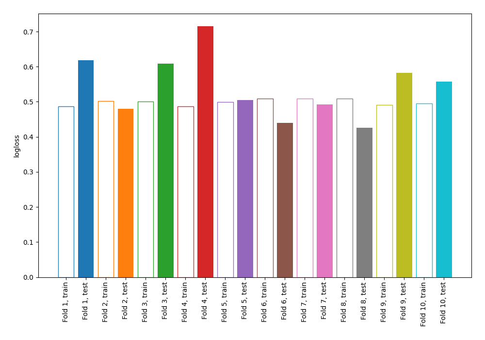

# Summary of 1_DecisionTree

## Decision Tree
- **criterion**: entropy
- **max_depth**: 2
- **explain_level**: 0

## Validation
 - **validation_type**: kfold
 - **k_folds**: 10
 - **shuffle**: False

## Optimized metric
logloss

## Training time

0.9 seconds

## Metric details
|           |    score |   threshold |
|:----------|---------:|------------:|
| logloss   | 0.542369 | nan         |
| auc       | 0.760746 | nan         |
| f1        | 0.61642  |   0.256173  |
| accuracy  | 0.753906 |   0.521245  |
| precision | 0.72067  |   0.521245  |
| recall    | 1        |   0.0140625 |
| mcc       | 0.429917 |   0.521245  |

## Confusion matrix (at threshold=0.256173)
|                     |   Predicted as negative |   Predicted as positive |
|:--------------------|------------------------:|------------------------:|
| Labeled as negative |                     254 |                     246 |
| Labeled as positive |                      39 |                     229 |

## Learning curves
