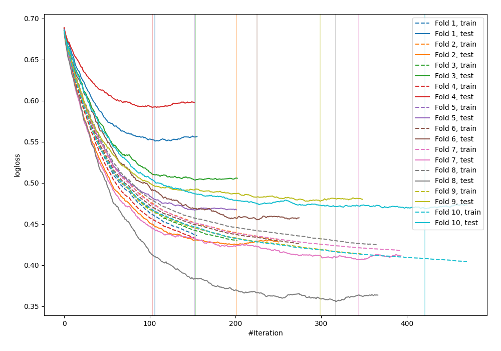

# Summary of 20_Xgboost

## Extreme Gradient Boosting (Xgboost)
- **objective**: binary:logistic
- **eval_metric**: logloss
- **eta**: 0.025
- **max_depth**: 2
- **min_child_weight**: 6
- **subsample**: 0.3
- **colsample_bytree**: 0.5
- **explain_level**: 0

## Validation
 - **validation_type**: kfold
 - **k_folds**: 10
 - **shuffle**: False

## Optimized metric
logloss

## Training time

2.3 seconds

## Metric details
|           |    score |   threshold |
|:----------|---------:|------------:|
| logloss   | 0.470239 | nan         |
| auc       | 0.840134 | nan         |
| f1        | 0.693241 |   0.386572  |
| accuracy  | 0.773438 |   0.398921  |
| precision | 0.865672 |   0.739084  |
| recall    | 1        |   0.0147604 |
| mcc       | 0.513715 |   0.398921  |

## Confusion matrix (at threshold=0.386572)
|                     |   Predicted as negative |   Predicted as positive |
|:--------------------|------------------------:|------------------------:|
| Labeled as negative |                     391 |                     109 |
| Labeled as positive |                      68 |                     200 |

## Learning curves
