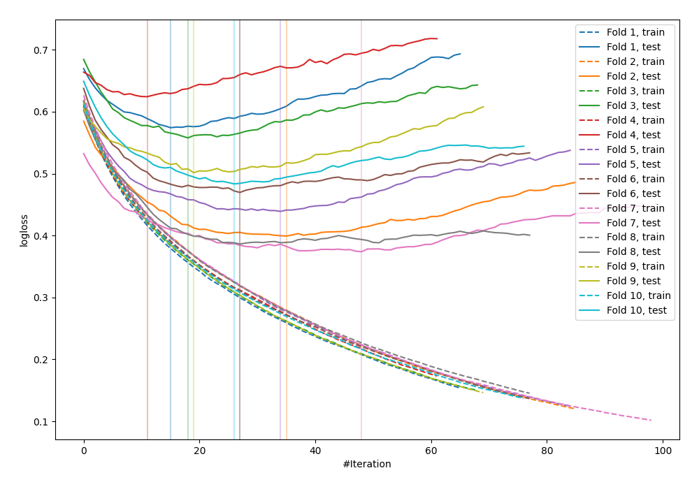

# Summary of 22_LightGBM

## LightGBM
- **objective**: binary
- **metric**: binary_logloss
- **num_leaves**: 31
- **learning_rate**: 0.075
- **feature_fraction**: 1.0
- **bagging_fraction**: 1.0
- **min_data_in_leaf**: 20
- **explain_level**: 0

## Validation
 - **validation_type**: kfold
 - **k_folds**: 10
 - **shuffle**: False

## Optimized metric
logloss

## Training time

1.7 seconds

## Metric details
|           |    score |   threshold |
|:----------|---------:|------------:|
| logloss   | 0.480838 | nan         |
| auc       | 0.829959 | nan         |
| f1        | 0.681564 |   0.422348  |
| accuracy  | 0.786458 |   0.453853  |
| precision | 0.811321 |   0.692241  |
| recall    | 1        |   0.0132136 |
| mcc       | 0.520723 |   0.453853  |

## Confusion matrix (at threshold=0.422348)
|                     |   Predicted as negative |   Predicted as positive |
|:--------------------|------------------------:|------------------------:|
| Labeled as negative |                     414 |                      86 |
| Labeled as positive |                      85 |                     183 |

## Learning curves
