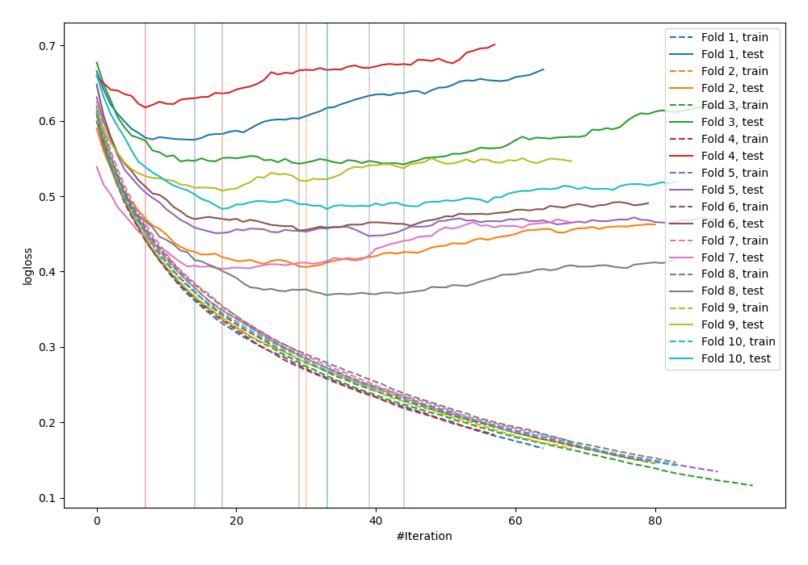

# Summary of 23_LightGBM

## LightGBM
- **objective**: binary
- **metric**: binary_logloss
- **num_leaves**: 15
- **learning_rate**: 0.1
- **feature_fraction**: 0.9
- **bagging_fraction**: 0.9
- **min_data_in_leaf**: 10
- **explain_level**: 0

## Validation
 - **validation_type**: kfold
 - **k_folds**: 10
 - **shuffle**: False

## Optimized metric
logloss

## Training time

1.5 seconds

## Metric details
|           |    score |    threshold |
|:----------|---------:|-------------:|
| logloss   | 0.480395 | nan          |
| auc       | 0.827007 | nan          |
| f1        | 0.682616 |   0.283877   |
| accuracy  | 0.776042 |   0.52887    |
| precision | 1        |   0.928414   |
| recall    | 1        |   0.00692097 |
| mcc       | 0.487138 |   0.52887    |

## Confusion matrix (at threshold=0.283877)
|                     |   Predicted as negative |   Predicted as positive |
|:--------------------|------------------------:|------------------------:|
| Labeled as negative |                     355 |                     145 |
| Labeled as positive |                      54 |                     214 |

## Learning curves
