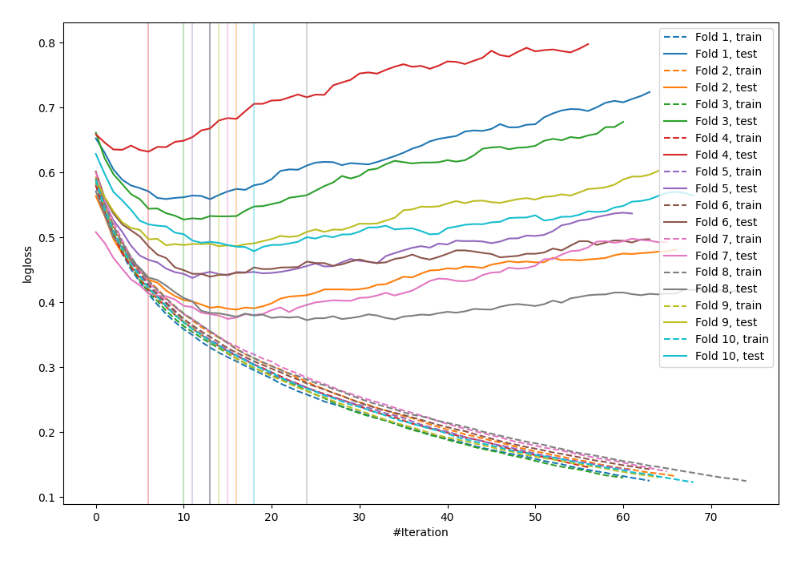

# Summary of 24_LightGBM

## LightGBM
- **objective**: binary
- **metric**: binary_logloss
- **num_leaves**: 15
- **learning_rate**: 0.15
- **feature_fraction**: 0.9
- **bagging_fraction**: 1.0
- **min_data_in_leaf**: 20
- **explain_level**: 0

## Validation
 - **validation_type**: kfold
 - **k_folds**: 10
 - **shuffle**: False

## Optimized metric
logloss

## Training time

1.4 seconds

## Metric details
|           |    score |   threshold |
|:----------|---------:|------------:|
| logloss   | 0.469618 | nan         |
| auc       | 0.838761 | nan         |
| f1        | 0.692593 |   0.411121  |
| accuracy  | 0.785156 |   0.443134  |
| precision | 0.831579 |   0.726115  |
| recall    | 1        |   0.0145784 |
| mcc       | 0.525974 |   0.411121  |

## Confusion matrix (at threshold=0.411121)
|                     |   Predicted as negative |   Predicted as positive |
|:--------------------|------------------------:|------------------------:|
| Labeled as negative |                     415 |                      85 |
| Labeled as positive |                      81 |                     187 |

## Learning curves
