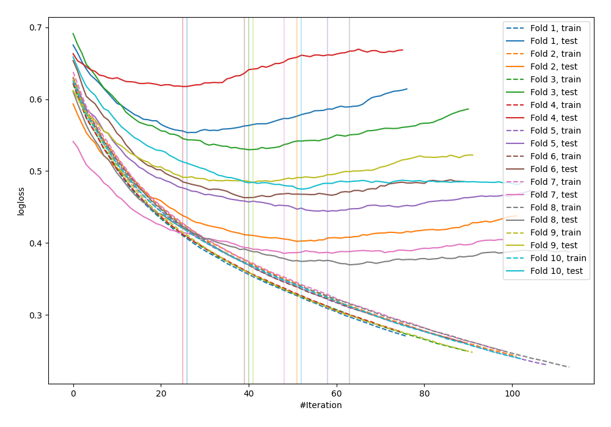

# Summary of 25_LightGBM

## LightGBM
- **objective**: binary
- **metric**: binary_logloss
- **num_leaves**: 31
- **learning_rate**: 0.05
- **feature_fraction**: 0.9
- **bagging_fraction**: 1.0
- **min_data_in_leaf**: 30
- **explain_level**: 0

## Validation
 - **validation_type**: kfold
 - **k_folds**: 10
 - **shuffle**: False

## Optimized metric
logloss

## Training time

1.6 seconds

## Metric details
|           |    score |   threshold |
|:----------|---------:|------------:|
| logloss   | 0.472376 | nan         |
| auc       | 0.838769 | nan         |
| f1        | 0.699647 |   0.386032  |
| accuracy  | 0.778646 |   0.386032  |
| precision | 0.822917 |   0.700455  |
| recall    | 1        |   0.0192897 |
| mcc       | 0.527021 |   0.386032  |

## Confusion matrix (at threshold=0.386032)
|                     |   Predicted as negative |   Predicted as positive |
|:--------------------|------------------------:|------------------------:|
| Labeled as negative |                     400 |                     100 |
| Labeled as positive |                      70 |                     198 |

## Learning curves
