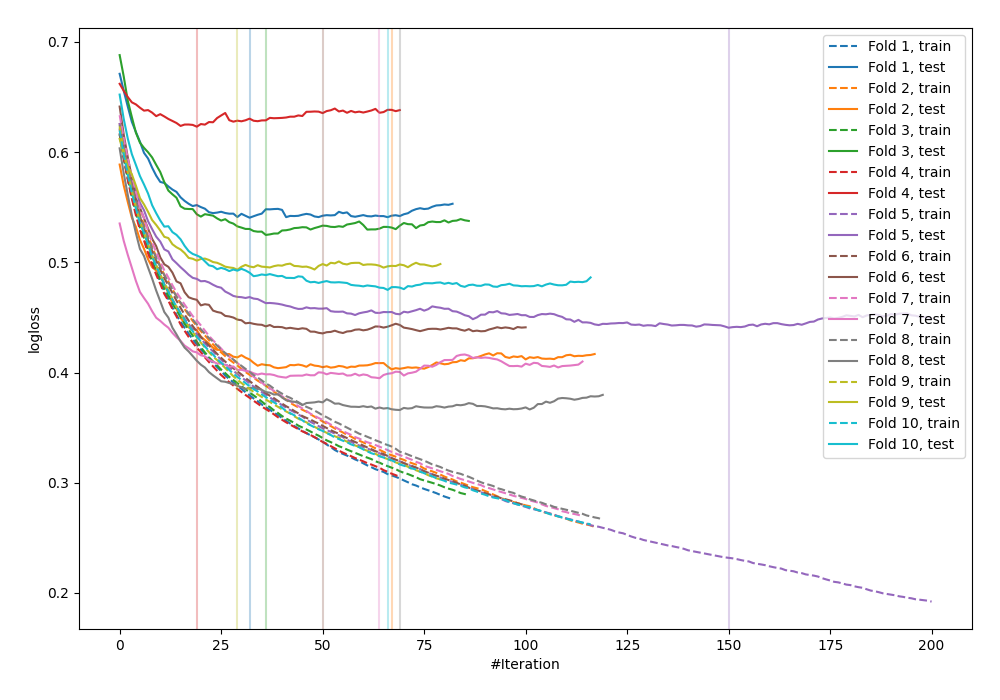

# Summary of 26_LightGBM

## LightGBM
- **objective**: binary
- **metric**: binary_logloss
- **num_leaves**: 7
- **learning_rate**: 0.075
- **feature_fraction**: 0.9
- **bagging_fraction**: 0.8
- **min_data_in_leaf**: 5
- **explain_level**: 0

## Validation
 - **validation_type**: kfold
 - **k_folds**: 10
 - **shuffle**: False

## Optimized metric
logloss

## Training time

1.7 seconds

## Metric details
|           |    score |    threshold |
|:----------|---------:|-------------:|
| logloss   | 0.469663 | nan          |
| auc       | 0.837201 | nan          |
| f1        | 0.697017 |   0.292552   |
| accuracy  | 0.776042 |   0.476301   |
| precision | 0.857143 |   0.791042   |
| recall    | 1        |   0.00469828 |
| mcc       | 0.514769 |   0.367425   |

## Confusion matrix (at threshold=0.292552)
|                     |   Predicted as negative |   Predicted as positive |
|:--------------------|------------------------:|------------------------:|
| Labeled as negative |                     353 |                     147 |
| Labeled as positive |                      46 |                     222 |

## Learning curves
