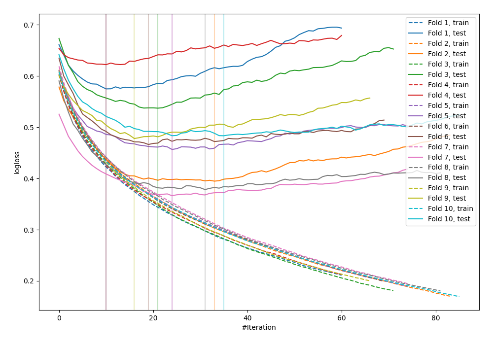

# Summary of 27_LightGBM

## LightGBM
- **objective**: binary
- **metric**: binary_logloss
- **num_leaves**: 15
- **learning_rate**: 0.1
- **feature_fraction**: 1.0
- **bagging_fraction**: 0.8
- **min_data_in_leaf**: 30
- **explain_level**: 0

## Validation
 - **validation_type**: kfold
 - **k_folds**: 10
 - **shuffle**: False

## Optimized metric
logloss

## Training time

1.5 seconds

## Metric details
|           |    score |   threshold |
|:----------|---------:|------------:|
| logloss   | 0.475821 | nan         |
| auc       | 0.833205 | nan         |
| f1        | 0.685271 |   0.284018  |
| accuracy  | 0.778646 |   0.439457  |
| precision | 0.842105 |   0.742447  |
| recall    | 1        |   0.0124122 |
| mcc       | 0.508029 |   0.439457  |

## Confusion matrix (at threshold=0.284018)
|                     |   Predicted as negative |   Predicted as positive |
|:--------------------|------------------------:|------------------------:|
| Labeled as negative |                     344 |                     156 |
| Labeled as positive |                      47 |                     221 |

## Learning curves
