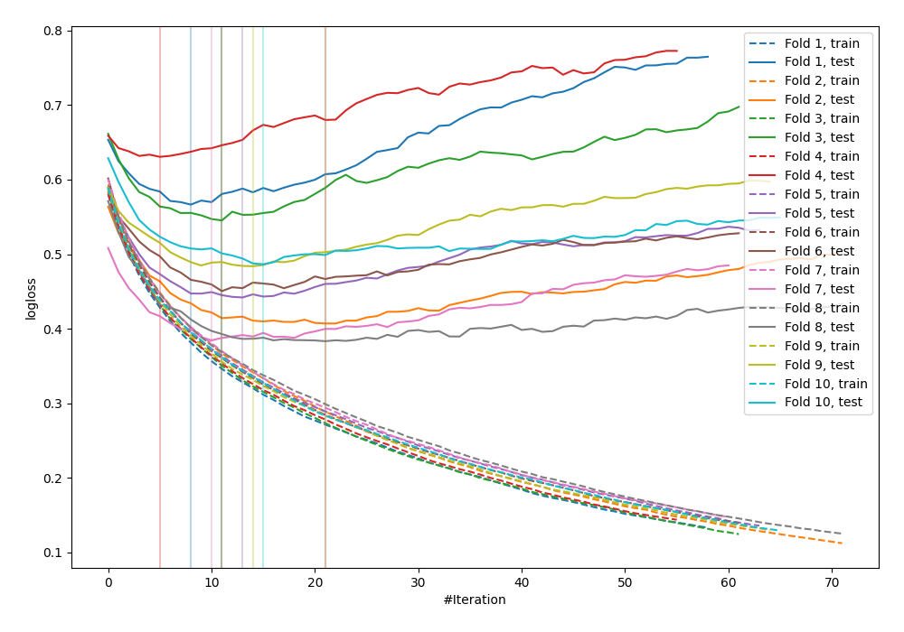

# Summary of 28_LightGBM

## LightGBM
- **objective**: binary
- **metric**: binary_logloss
- **num_leaves**: 15
- **learning_rate**: 0.15
- **feature_fraction**: 1.0
- **bagging_fraction**: 0.9
- **min_data_in_leaf**: 20
- **explain_level**: 0

## Validation
 - **validation_type**: kfold
 - **k_folds**: 10
 - **shuffle**: False

## Optimized metric
logloss

## Training time

1.4 seconds

## Metric details
|           |    score |   threshold |
|:----------|---------:|------------:|
| logloss   | 0.47799  | nan         |
| auc       | 0.831168 | nan         |
| f1        | 0.687211 |   0.276025  |
| accuracy  | 0.776042 |   0.480821  |
| precision | 0.811111 |   0.72211   |
| recall    | 1        |   0.0162088 |
| mcc       | 0.501432 |   0.408222  |

## Confusion matrix (at threshold=0.276025)
|                     |   Predicted as negative |   Predicted as positive |
|:--------------------|------------------------:|------------------------:|
| Labeled as negative |                     342 |                     158 |
| Labeled as positive |                      45 |                     223 |

## Learning curves
