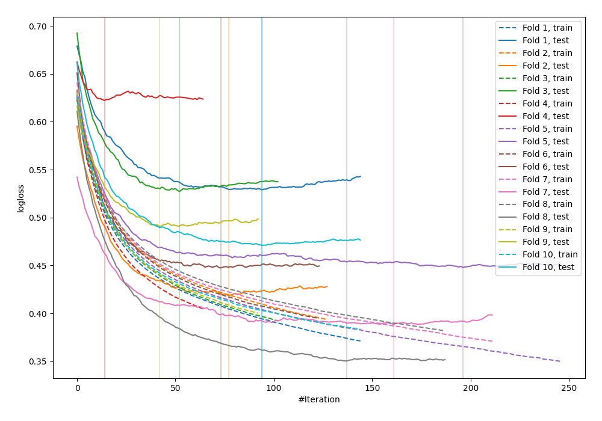

# Summary of 29_LightGBM

## LightGBM
- **objective**: binary
- **metric**: binary_logloss
- **num_leaves**: 3
- **learning_rate**: 0.075
- **feature_fraction**: 0.9
- **bagging_fraction**: 0.8
- **min_data_in_leaf**: 20
- **explain_level**: 0

## Validation
 - **validation_type**: kfold
 - **k_folds**: 10
 - **shuffle**: False

## Optimized metric
logloss

## Training time

1.5 seconds

## Metric details
|           |    score |   threshold |
|:----------|---------:|------------:|
| logloss   | 0.469213 | nan         |
| auc       | 0.839142 | nan         |
| f1        | 0.690236 |   0.344307  |
| accuracy  | 0.778646 |   0.509116  |
| precision | 0.847222 |   0.764612  |
| recall    | 1        |   0.0057624 |
| mcc       | 0.504281 |   0.344307  |

## Confusion matrix (at threshold=0.344307)
|                     |   Predicted as negative |   Predicted as positive |
|:--------------------|------------------------:|------------------------:|
| Labeled as negative |                     379 |                     121 |
| Labeled as positive |                      63 |                     205 |

## Learning curves
