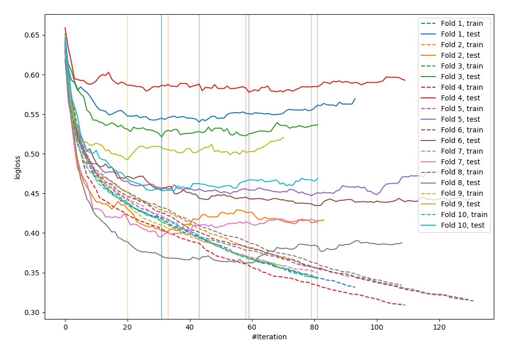

# Summary of 30_CatBoost

## CatBoost
- **learning_rate**: 0.2
- **depth**: 2
- **rsm**: 0.9
- **subsample**: 0.8
- **min_data_in_leaf**: 1
- **explain_level**: 0

## Validation
 - **validation_type**: kfold
 - **k_folds**: 10
 - **shuffle**: False

## Optimized metric
logloss

## Training time

2.2 seconds

## Metric details
|           |    score |    threshold |
|:----------|---------:|-------------:|
| logloss   | 0.462482 | nan          |
| auc       | 0.843493 | nan          |
| f1        | 0.702163 |   0.329045   |
| accuracy  | 0.779948 |   0.426718   |
| precision | 0.9      |   0.925054   |
| recall    | 1        |   0.00520231 |
| mcc       | 0.523003 |   0.340253   |

## Confusion matrix (at threshold=0.329045)
|                     |   Predicted as negative |   Predicted as positive |
|:--------------------|------------------------:|------------------------:|
| Labeled as negative |                     378 |                     122 |
| Labeled as positive |                      57 |                     211 |

## Learning curves
