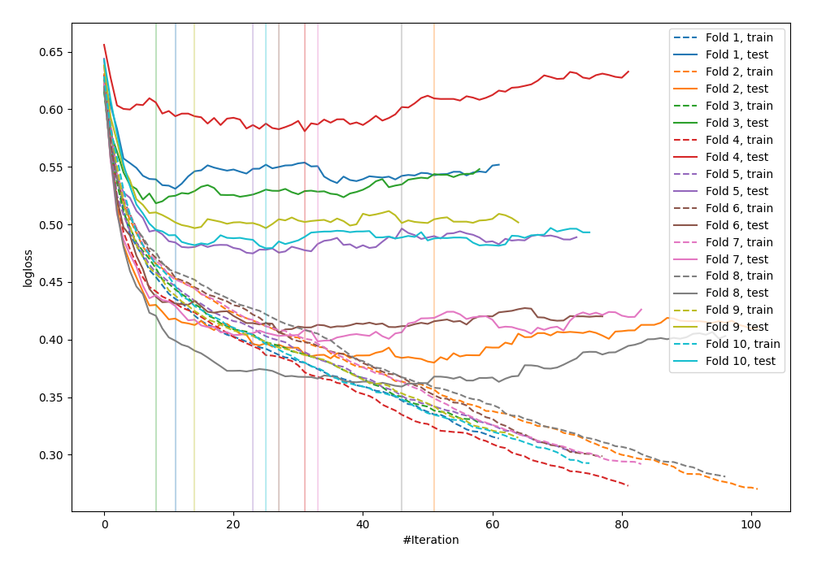

# Summary of 31_CatBoost

## CatBoost
- **learning_rate**: 0.2
- **depth**: 3
- **rsm**: 0.9
- **subsample**: 0.7
- **min_data_in_leaf**: 15
- **explain_level**: 0

## Validation
 - **validation_type**: kfold
 - **k_folds**: 10
 - **shuffle**: False

## Optimized metric
logloss

## Training time

2.1 seconds

## Metric details
|           |    score |    threshold |
|:----------|---------:|-------------:|
| logloss   | 0.462377 | nan          |
| auc       | 0.84278  | nan          |
| f1        | 0.6944   |   0.312249   |
| accuracy  | 0.776042 |   0.400978   |
| precision | 0.882353 |   0.87712    |
| recall    | 1        |   0.00733176 |
| mcc       | 0.511054 |   0.392727   |

## Confusion matrix (at threshold=0.312249)
|                     |   Predicted as negative |   Predicted as positive |
|:--------------------|------------------------:|------------------------:|
| Labeled as negative |                     360 |                     140 |
| Labeled as positive |                      51 |                     217 |

## Learning curves
