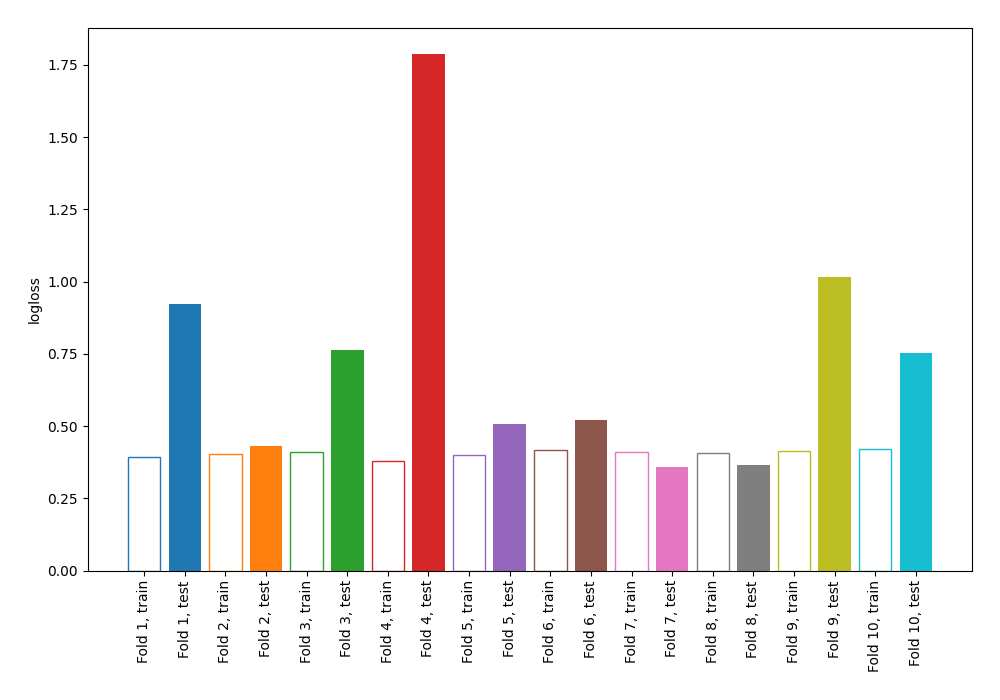

# Summary of 3_DecisionTree

## Decision Tree
- **criterion**: gini
- **max_depth**: 4
- **explain_level**: 0

## Validation
 - **validation_type**: kfold
 - **k_folds**: 10
 - **shuffle**: False

## Optimized metric
logloss

## Training time

0.7 seconds

## Metric details
|           |    score |   threshold |
|:----------|---------:|------------:|
| logloss   | 0.742463 |  nan        |
| auc       | 0.778847 |  nan        |
| f1        | 0.652439 |    0.23465  |
| accuracy  | 0.736979 |    0.538052 |
| precision | 0.759615 |    0.764263 |
| recall    | 0.958955 |    0        |
| mcc       | 0.437184 |    0.321429 |

## Confusion matrix (at threshold=0.23465)
|                     |   Predicted as negative |   Predicted as positive |
|:--------------------|------------------------:|------------------------:|
| Labeled as negative |                     326 |                     174 |
| Labeled as positive |                      54 |                     214 |

## Learning curves
