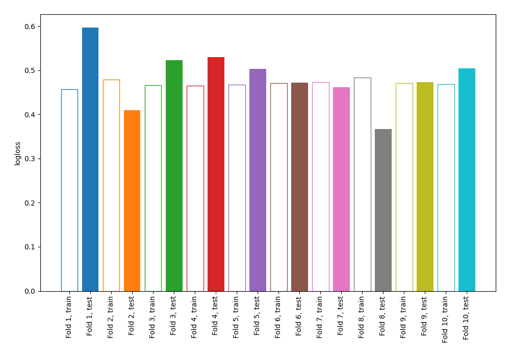

# Summary of 4_Linear

## Logistic Regression (Linear)
- **explain_level**: 0

## Validation
 - **validation_type**: kfold
 - **k_folds**: 10
 - **shuffle**: False

## Optimized metric
logloss

## Training time

6.3 seconds

## Metric details
|           |    score |    threshold |
|:----------|---------:|-------------:|
| logloss   | 0.484221 | nan          |
| auc       | 0.828873 | nan          |
| f1        | 0.676871 |   0.330781   |
| accuracy  | 0.778646 |   0.49216    |
| precision | 0.842105 |   0.831621   |
| recall    | 1        |   0.00134762 |
| mcc       | 0.495947 |   0.49216    |

## Confusion matrix (at threshold=0.330781)
|                     |   Predicted as negative |   Predicted as positive |
|:--------------------|------------------------:|------------------------:|
| Labeled as negative |                     379 |                     121 |
| Labeled as positive |                      69 |                     199 |

## Learning curves
