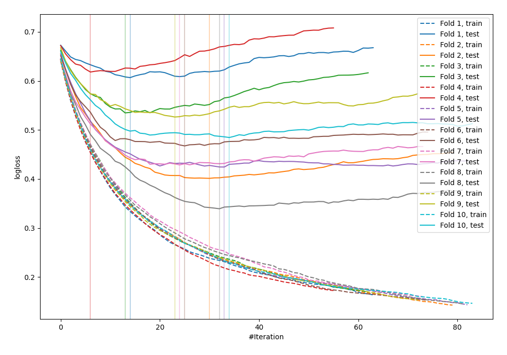

# Summary of 7_Default_Xgboost

## Extreme Gradient Boosting (Xgboost)
- **objective**: binary:logistic
- **eval_metric**: logloss
- **eta**: 0.1
- **max_depth**: 6
- **min_child_weight**: 1
- **subsample**: 1.0
- **colsample_bytree**: 1.0
- **explain_level**: 0

## Validation
 - **validation_type**: kfold
 - **k_folds**: 10
 - **shuffle**: False

## Optimized metric
logloss

## Training time

2.6 seconds

## Metric details
|           |    score |   threshold |
|:----------|---------:|------------:|
| logloss   | 0.483146 | nan         |
| auc       | 0.826604 | nan         |
| f1        | 0.689764 |   0.328121  |
| accuracy  | 0.772135 |   0.535006  |
| precision | 0.818841 |   0.655646  |
| recall    | 1        |   0.0192319 |
| mcc       | 0.497304 |   0.328121  |

## Confusion matrix (at threshold=0.328121)
|                     |   Predicted as negative |   Predicted as positive |
|:--------------------|------------------------:|------------------------:|
| Labeled as negative |                     352 |                     148 |
| Labeled as positive |                      49 |                     219 |

## Learning curves
