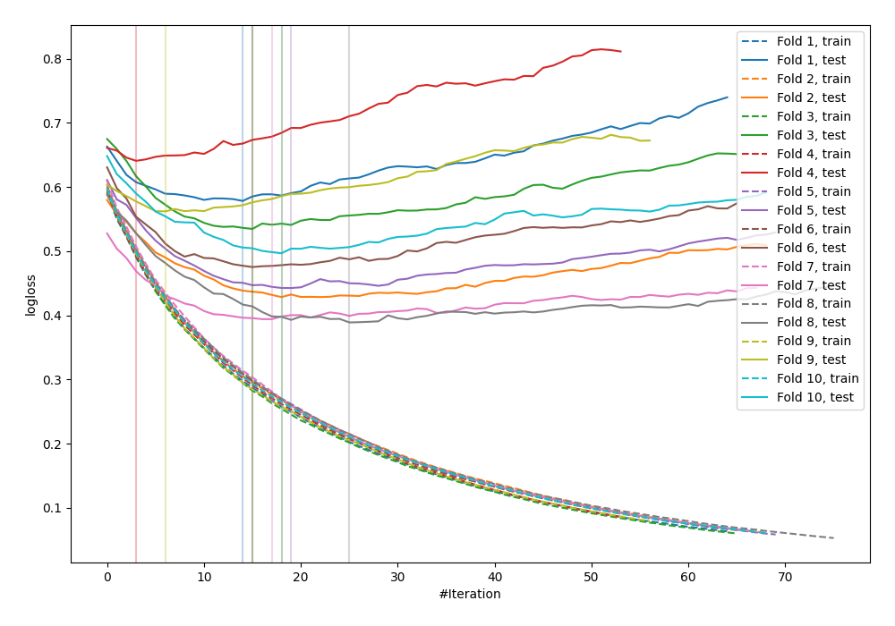

# Summary of 8_Default_LightGBM

## LightGBM
- **objective**: binary
- **metric**: binary_logloss
- **num_leaves**: 31
- **learning_rate**: 0.1
- **feature_fraction**: 0.9
- **bagging_fraction**: 0.9
- **min_data_in_leaf**: 10
- **explain_level**: 0

## Validation
 - **validation_type**: kfold
 - **k_folds**: 10
 - **shuffle**: False

## Optimized metric
logloss

## Training time

1.7 seconds

## Metric details
|           |    score |   threshold |
|:----------|---------:|------------:|
| logloss   | 0.494195 | nan         |
| auc       | 0.817944 | nan         |
| f1        | 0.667678 |   0.268754  |
| accuracy  | 0.772135 |   0.478041  |
| precision | 0.849315 |   0.715898  |
| recall    | 1        |   0.0274852 |
| mcc       | 0.481    |   0.478041  |

## Confusion matrix (at threshold=0.268754)
|                     |   Predicted as negative |   Predicted as positive |
|:--------------------|------------------------:|------------------------:|
| Labeled as negative |                     329 |                     171 |
| Labeled as positive |                      48 |                     220 |

## Learning curves
