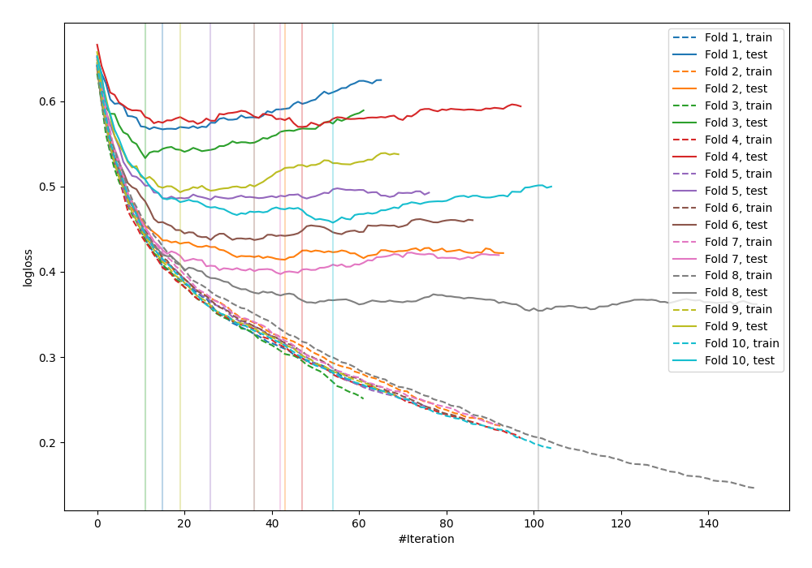

# Summary of 9_Default_CatBoost

## CatBoost
- **learning_rate**: 0.1
- **depth**: 6
- **rsm**: 0.9
- **subsample**: 1.0
- **min_data_in_leaf**: 15
- **explain_level**: 0

## Validation
 - **validation_type**: kfold
 - **k_folds**: 10
 - **shuffle**: False

## Optimized metric
logloss

## Training time

3.9 seconds

## Metric details
|           |    score |    threshold |
|:----------|---------:|-------------:|
| logloss   | 0.470793 | nan          |
| auc       | 0.83744  | nan          |
| f1        | 0.68546  |   0.275582   |
| accuracy  | 0.773438 |   0.450925   |
| precision | 0.860465 |   0.738901   |
| recall    | 1        |   0.00274491 |
| mcc       | 0.492711 |   0.450925   |

## Confusion matrix (at threshold=0.275582)
|                     |   Predicted as negative |   Predicted as positive |
|:--------------------|------------------------:|------------------------:|
| Labeled as negative |                     325 |                     175 |
| Labeled as positive |                      37 |                     231 |

## Learning curves
