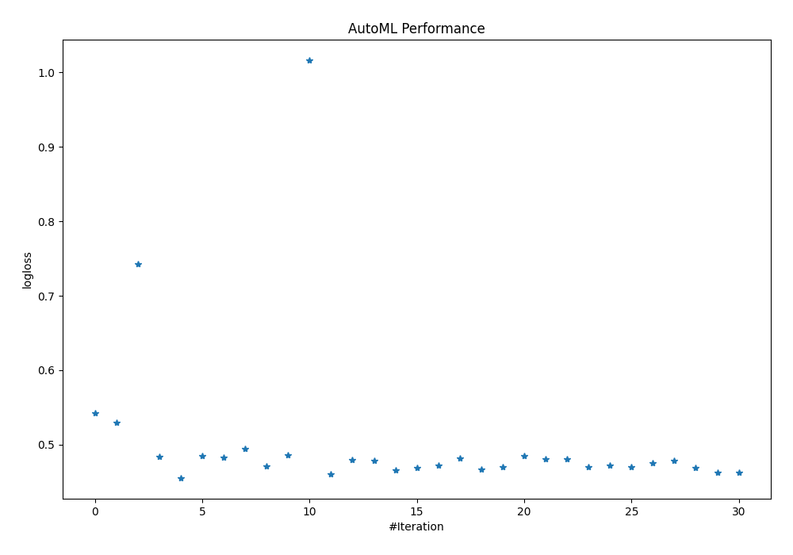
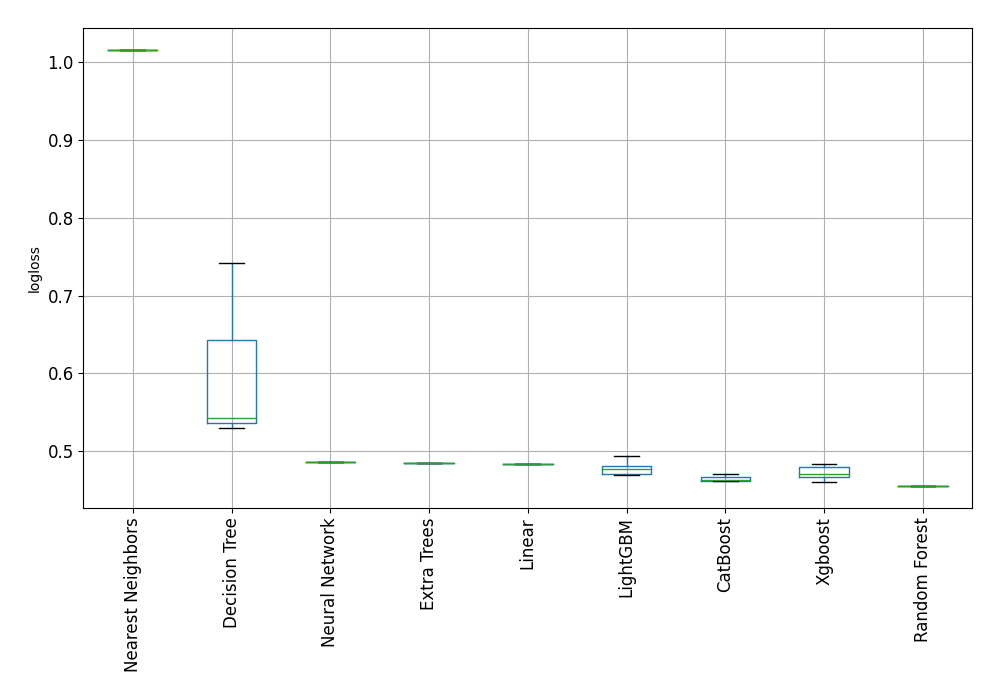

# AutoML Leaderboard

| Best model   | name                        | model_type        | metric_type   |   metric_value |   train_time | Link                                                  |
|:-------------|:----------------------------|:------------------|:--------------|---------------:|-------------:|:------------------------------------------------------|
|              | 1_DecisionTree              | Decision Tree     | logloss       |       0.542369 |         1.41 | [Results link](1_DecisionTree/README.md)              |
|              | 2_DecisionTree              | Decision Tree     | logloss       |       0.52954  |         1.02 | [Results link](2_DecisionTree/README.md)              |
|              | 3_DecisionTree              | Decision Tree     | logloss       |       0.742463 |         1.02 | [Results link](3_DecisionTree/README.md)              |
|              | 4_Linear                    | Linear            | logloss       |       0.484221 |         6.66 | [Results link](4_Linear/README.md)                    |
| **the best** | 5_Default_RandomForest      | Random Forest     | logloss       |       0.455452 |         9.96 | [Results link](5_Default_RandomForest/README.md)      |
|              | 6_Default_ExtraTrees        | Extra Trees       | logloss       |       0.484952 |        12.84 | [Results link](6_Default_ExtraTrees/README.md)        |
|              | 7_Default_Xgboost           | Xgboost           | logloss       |       0.483146 |         3.09 | [Results link](7_Default_Xgboost/README.md)           |
|              | 8_Default_LightGBM          | LightGBM          | logloss       |       0.494195 |         2.34 | [Results link](8_Default_LightGBM/README.md)          |
|              | 9_Default_CatBoost          | CatBoost          | logloss       |       0.470793 |         4.43 | [Results link](9_Default_CatBoost/README.md)          |
|              | 10_Default_NeuralNetwork    | Neural Network    | logloss       |       0.486332 |        29.69 | [Results link](10_Default_NeuralNetwork/README.md)    |
|              | 11_Default_NearestNeighbors | Nearest Neighbors | logloss       |       1.016    |         3.32 | [Results link](11_Default_NearestNeighbors/README.md) |
|              | 12_Xgboost                  | Xgboost           | logloss       |       0.46063  |         2.3  | [Results link](12_Xgboost/README.md)                  |
|              | 13_Xgboost                  | Xgboost           | logloss       |       0.479894 |         2.14 | [Results link](13_Xgboost/README.md)                  |
|              | 14_Xgboost                  | Xgboost           | logloss       |       0.478465 |         2.66 | [Results link](14_Xgboost/README.md)                  |
|              | 15_Xgboost                  | Xgboost           | logloss       |       0.465318 |         2.3  | [Results link](15_Xgboost/README.md)                  |
|              | 16_Xgboost                  | Xgboost           | logloss       |       0.468918 |         2.8  | [Results link](16_Xgboost/README.md)                  |
|              | 17_Xgboost                  | Xgboost           | logloss       |       0.471584 |         3.02 | [Results link](17_Xgboost/README.md)                  |
|              | 18_Xgboost                  | Xgboost           | logloss       |       0.481519 |         2.16 | [Results link](18_Xgboost/README.md)                  |
|              | 19_Xgboost                  | Xgboost           | logloss       |       0.466374 |         2.1  | [Results link](19_Xgboost/README.md)                  |
|              | 20_Xgboost                  | Xgboost           | logloss       |       0.470239 |         2.9  | [Results link](20_Xgboost/README.md)                  |
|              | 21_LightGBM                 | LightGBM          | logloss       |       0.484824 |         2.26 | [Results link](21_LightGBM/README.md)                 |
|              | 22_LightGBM                 | LightGBM          | logloss       |       0.480838 |         2.17 | [Results link](22_LightGBM/README.md)                 |
|              | 23_LightGBM                 | LightGBM          | logloss       |       0.480395 |         1.94 | [Results link](23_LightGBM/README.md)                 |
|              | 24_LightGBM                 | LightGBM          | logloss       |       0.469618 |         1.83 | [Results link](24_LightGBM/README.md)                 |
|              | 25_LightGBM                 | LightGBM          | logloss       |       0.472376 |         2.07 | [Results link](25_LightGBM/README.md)                 |
|              | 26_LightGBM                 | LightGBM          | logloss       |       0.469663 |         2.15 | [Results link](26_LightGBM/README.md)                 |
|              | 27_LightGBM                 | LightGBM          | logloss       |       0.475821 |         1.95 | [Results link](27_LightGBM/README.md)                 |
|              | 28_LightGBM                 | LightGBM          | logloss       |       0.47799  |         1.95 | [Results link](28_LightGBM/README.md)                 |
|              | 29_LightGBM                 | LightGBM          | logloss       |       0.469213 |         1.94 | [Results link](29_LightGBM/README.md)                 |
|              | 30_CatBoost                 | CatBoost          | logloss       |       0.462482 |         2.64 | [Results link](30_CatBoost/README.md)                 |
|              | 31_CatBoost                 | CatBoost          | logloss       |       0.462377 |         2.71 | [Results link](31_CatBoost/README.md)                 |

### AutoML Performance

### AutoML Performance Boxplot
