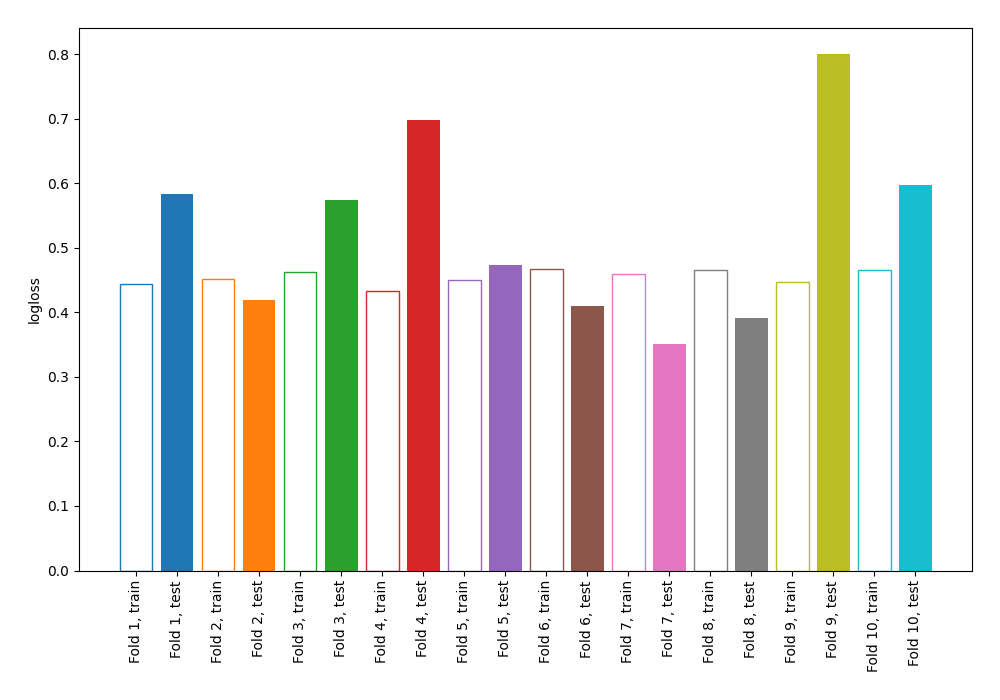

# Summary of 2_DecisionTree

## Decision Tree
- **criterion**: gini
- **max_depth**: 3
- **explain_level**: 0

## Validation
 - **validation_type**: kfold
 - **k_folds**: 10
 - **shuffle**: False

## Optimized metric
logloss

## Training time

1.6 seconds

## Metric details
|           |    score |   threshold |
|:----------|---------:|------------:|
| logloss   | 0.52954  | nan         |
| auc       | 0.793045 | nan         |
| f1        | 0.652422 |   0.208213  |
| accuracy  | 0.75     |   0.583041  |
| precision | 0.824176 |   0.801471  |
| recall    | 1        |   0.0130435 |
| mcc       | 0.42735  |   0.208213  |

## Confusion matrix (at threshold=0.208213)
|                     |   Predicted as negative |   Predicted as positive |
|:--------------------|------------------------:|------------------------:|
| Labeled as negative |                     295 |                     205 |
| Labeled as positive |                      39 |                     229 |

## Learning curves
